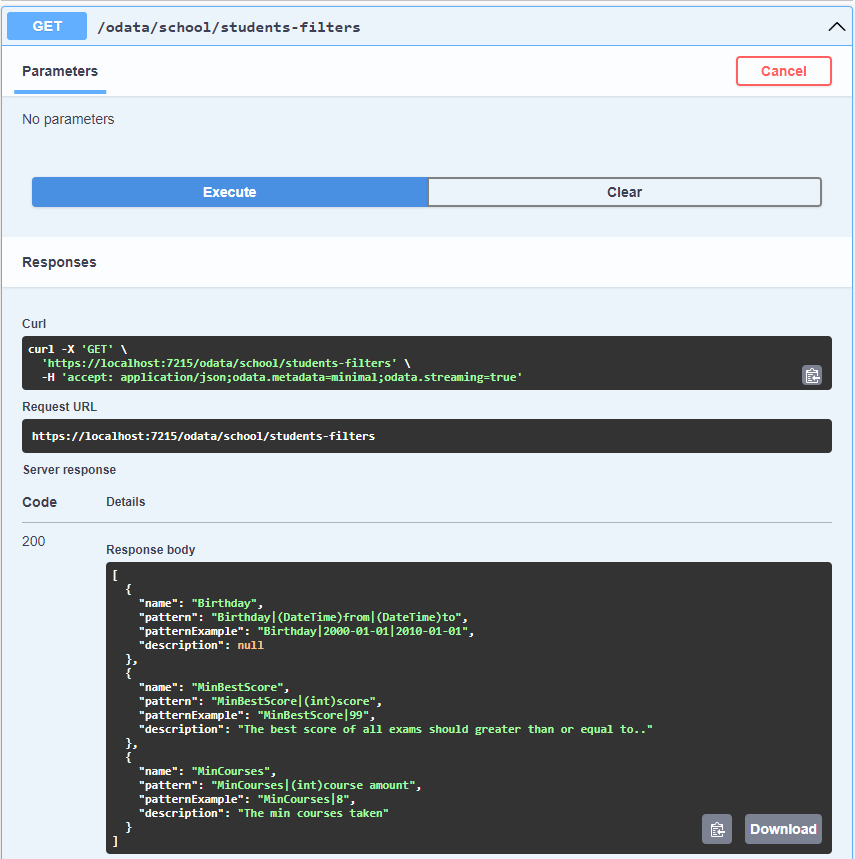
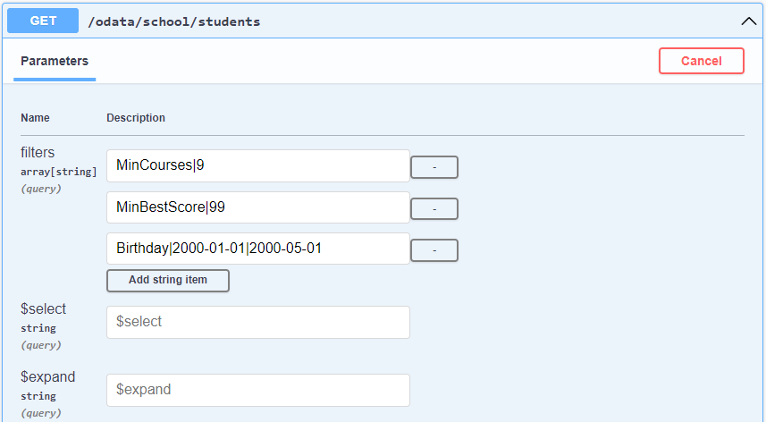
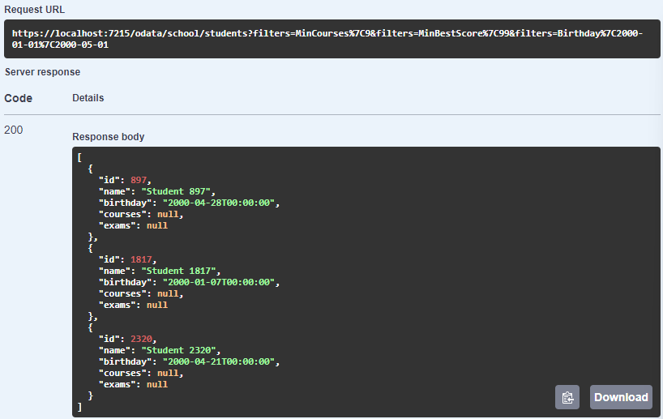

# Pre-defined filter for IQueryable, compatible with OData

Capturing the full scope of this work in a single title is challenging. The task involves applying pre-defined filters, parsed from an HTTP query string, to a collection—typically an `IQueryable` object within the context of EF Core.

## Background

In large projects, we often encounter a common challenge: the need to filter various collections in a consistent, universal way. Here, "universal" implies a standardized approach for both UI and backend logic, ensuring they follow a cohesive organizational structure. Since enforcing a uniform coding style across all developers isn’t feasible, it’s practical to establish a solution that simplifies and unifies the implementation of filters for everyone.

Here are some considerations:

- **Flexible Filter Combinations**: The filter criteria should support flexible combinations, allowing for multiple filters, such as date ranges combined with text or numeric filters.
- **URL-based Filter Parameters**: Filter parameters should be easily passed via the URL, preferably through query strings, and should remain optional without impacting the normal workflow if unused.
- **Compatibility with OData** *(optional)*: Ideally, the filter setup should avoid conflicts with OData or allow integration with OData queries.
- **Simplicity in Usage**: The filtering approach should be straightforward and intuitive for developers to implement.
- **Avoid Redundant Code**: Redundant code should be minimized to simplify maintenance and reduce complexity.
- **Optimized SQL Queries**: Avoid generating unnecessary SQL queries to enhance performance when using SQL with EF Core, ensuring efficient translation into SQL statements.
- **Swagger & NSwag Compatibility**: Ensure compatibility with Swagger and NSwag to document endpoints, allowing for clear, automated API documentation.
- **Filter Documentation for Frontend**: Provide a way to communicate available filters and their signatures to frontend developers, helping them understand which filters are supported and how to use them effectively.

## Concept

I’ll skip the detailed thought process here, though it took considerable time.

Since each filter focuses on a single property (e.g., the `CreationTime` property of type `DateTime`), and the primary data types are limited (such as string, number, enum, and DateTime), it makes sense to create reusable filters based on data type rather than specific use cases. For each use case, we simply need to pass parameters to these shared filters, streamlining the filtering process.

For complex queries, such as `student => student.Exams.Any(e => e.Score > 80)`, we need a universal approach to pass expressions directly, enabling more advanced filtering without hardcoding specific criteria.

## Implementation

The implementation can be found in this [GitHub Repository](https://github.com/idea-lei/PredefinedFilterDemo).

## Usage

Usage demonstration can also be found in the [GitHub Repository](https://github.com/idea-lei/PredefinedFilterDemo). The Demo usage is in the `StudentFilterCollection.cs` and `SchoolODataController.cs`

Demo in Swagger:

